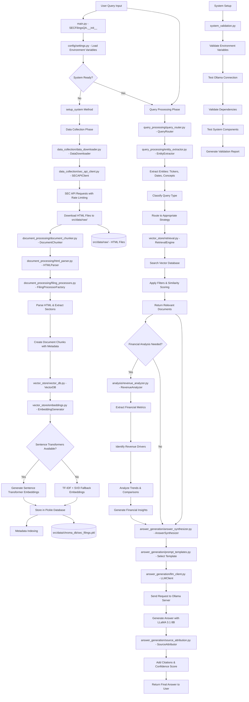

# 🔄 **COMPLETE SYSTEM FLOW DIAGRAM - SEC FILINGS QA AGENT**

> **Comprehensive Flow Analysis of the Scalar-Field Project**  
> **Repository:** https://github.com/Rehan018/Scalar-Field.git

---

## 📊 **VISUAL FLOW DIAGRAM (Mermaid)**



---

## 📋 **DETAILED STEP-BY-STEP WORKFLOW**

### **🚀 PHASE 1: SYSTEM INITIALIZATION**

#### **Step 1.1: Entry Point (`src/main.py`)**
- **File**: `src/main.py`
- **Class**: `SECFilingsQA`
- **Functions**: `__init__()`, `setup_system()`, `query()`
- **Task**: Initialize system components and orchestrate the entire workflow
- **Data Flow**: User input → System initialization → Component setup

#### **Step 1.2: Configuration Loading (`src/config/settings.py`)**
- **File**: `src/config/settings.py`
- **Functions**: Environment variable loading
- **Task**: Load all configuration from `.env` file
- **Key Variables**: 
  - `SEC_API_KEY`, `OLLAMA_URL`, `OLLAMA_MODEL`
  - `CHUNK_SIZE`, `CHUNK_OVERLAP`, `MAX_TOKENS`
  - `COMPANIES` (15 companies), `FILING_TYPES` (7 types)
- **Data Flow**: `.env` file → Configuration variables → System components

#### **Step 1.3: System Validation (`system_validation.py`)**
- **File**: `system_validation.py`
- **Functions**: 
  - `validate_environment_variables()`
  - `validate_ollama_connection()`
  - `validate_directories()`
  - `validate_dependencies()`
  - `validate_system_components()`
- **Task**: Comprehensive system health check
- **Data Flow**: System components → Validation checks → Status report

---

### **🔄 PHASE 2: DATA COLLECTION & PROCESSING**

#### **Step 2.1: Data Download Orchestration (`src/data_collection/data_downloader.py`)**
- **File**: `src/data_collection/data_downloader.py`
- **Class**: `DataDownloader`
- **Functions**: 
  - `download_all_companies()` - Main orchestrator
  - `download_single_company()` - Per-company processing
  - `download_company_filings_enhanced()` - Enhanced download with fallbacks
- **Task**: Coordinate concurrent downloads for all 15 companies
- **Algorithms**: 
  - **Concurrent Processing**: ThreadPoolExecutor with 5 workers
  - **Error Isolation**: Individual company failures don't affect others
  - **Rate Limiting**: Respect SEC API limits (95 requests/day)
- **Data Flow**: Company list → Concurrent downloads → HTML files

#### **Step 2.2: SEC API Integration (`src/data_collection/sec_api_client.py`)**
- **File**: `src/data_collection/sec_api_client.py`
- **Class**: `SECAPIClient`
- **Functions**:
  - `search_filings()` - Search SEC filings by company/type
  - `download_filing()` - Download individual filing
  - `search_filings_with_fallback()` - Fallback to existing files
  - `_find_actual_filing_document()` - Avoid XBRL viewer pages
- **Task**: Interface with SEC API and download actual filing documents
- **Algorithms**:
  - **Document Detection**: Identify actual filing vs XBRL viewer
  - **Rate Limiting**: Circuit breaker pattern for API failures
  - **Fallback Strategy**: Use existing files when API unavailable
  - **Content Validation**: Ensure downloaded content is actual filing
- **Data Flow**: SEC API → Filing URLs → HTML content → Local storage

#### **Step 2.3: HTML Parsing (`src/document_processing/html_parser.py`)**
- **File**: `src/document_processing/html_parser.py`
- **Class**: `HTMLParser`
- **Functions**:
  - `parse_file()` - Main parsing entry point
  - `parse_content()` - Parse HTML content
  - `_extract_document_info()` - Extract metadata
  - `_extract_sections()` - Identify document sections
  - `_extract_clean_text()` - Clean and extract text
- **Task**: Parse SEC HTML filings and extract structured content
- **Algorithms**:
  - **BeautifulSoup Parsing**: HTML structure analysis
  - **Section Detection**: Regex patterns for SEC sections
  - **Text Cleaning**: Remove scripts, styles, normalize whitespace
  - **Metadata Extraction**: Company name, filing date, form type
- **Data Flow**: HTML files → Parsed structure → Clean text + metadata

#### **Step 2.4: Filing-Specific Processing (`src/document_processing/filing_processors.py`)**
- **File**: `src/document_processing/filing_processors.py`
- **Classes**: 
  - `FilingProcessorFactory` - Factory pattern for processors
  - `TenKProcessor` - 10-K annual reports
  - `TenQProcessor` - 10-Q quarterly reports
  - `EightKProcessor` - 8-K current reports
  - `ProxyProcessor` - DEF 14A proxy statements
  - `InsiderTradingProcessor` - Forms 3/4/5
  - `FinancialContentIdentifier` - Content classification
- **Functions**:
  - `extract_sections()` - Filing-specific section extraction
  - `identify_financial_content_type()` - Classify content types
  - `calculate_content_quality_score()` - Quality assessment
- **Task**: Process different SEC filing types with specialized logic
- **Algorithms**:
  - **Pattern-Based Extraction**: Filing-specific regex patterns
  - **Section Classification**: Business, risk, financial, governance
  - **Quality Scoring**: Multi-factor content quality assessment
  - **Content Type Identification**: 6 financial content categories
- **Data Flow**: Parsed HTML → Filing-specific processing → Classified sections

#### **Step 2.5: Document Chunking (`src/document_processing/document_chunker.py`)**
- **File**: `src/document_processing/document_chunker.py`
- **Class**: `DocumentChunker`
- **Functions**:
  - `chunk_file()` - Process single file
  - `chunk_multiple_files()` - Batch processing
  - `_create_chunks()` - Core chunking algorithm
  - `_validate_filing_content()` - Content validation
  - `_enrich_chunk_metadata()` - Metadata enhancement
- **Task**: Split documents into searchable chunks with rich metadata
- **Algorithms**:
  - **Semantic Chunking**: 1000 words with 200-word overlap
  - **Content Validation**: Multi-stage quality pipeline
  - **Metadata Enrichment**: Financial concepts, importance scoring
  - **Quality Filtering**: Remove low-quality content
- **Data Flow**: Clean text → Validated chunks → Enriched metadata → DocumentChunk objects

---

### **🗄️ PHASE 3: VECTOR DATABASE & EMBEDDINGS**

#### **Step 3.1: Vector Database Management (`src/vector_store/vector_db.py`)**
- **File**: `src/vector_store/vector_db.py`
- **Class**: `VectorDB`
- **Functions**:
  - `add_chunks()` - Add document chunks to database
  - `search()` - Hybrid search with filtering
  - `_apply_filters()` - Metadata-based filtering
  - `_cosine_similarity()` - Similarity calculation
- **Task**: Store and search document chunks using vector embeddings
- **Algorithms**:
  - **Hybrid Search**: Semantic similarity + keyword matching
  - **Adaptive Scoring**: Different thresholds for different embedding methods
  - **Metadata Indexing**: Fast filtering by company, filing type, date
  - **Pickle Persistence**: Simple, reliable storage
- **Data Flow**: Document chunks → Embeddings → Vector storage → Search results

#### **Step 3.2: Embedding Generation (`src/vector_store/embeddings.py`)**
- **File**: `src/vector_store/embeddings.py`
- **Class**: `EmbeddingGenerator`
- **Functions**:
  - `generate_embeddings()` - Main embedding generation
  - `generate_single_embedding()` - Single text embedding
  - `_generate_fallback_embeddings()` - TF-IDF fallback
  - `_preprocess_financial_text()` - Financial domain preprocessing
- **Task**: Generate vector embeddings with robust fallback system
- **Algorithms**:
  - **Primary Method**: Sentence Transformers (all-MiniLM-L6-v2)
  - **Fallback Method**: TF-IDF + SVD (384 dimensions)
  - **Financial Optimization**: Custom stop words, term weighting
  - **Normalization**: L2 normalization for cosine similarity
- **Data Flow**: Text chunks → Embeddings (384-dim) → Normalized vectors

#### **Step 3.3: Retrieval Engine (`src/vector_store/retrieval.py`)**
- **File**: `src/vector_store/retrieval.py`
- **Class**: `RetrievalEngine`
- **Functions**:
  - `search_with_filters()` - Filtered search
  - `hybrid_search()` - Semantic + keyword search
  - `search_temporal()` - Time-based search
  - `_calculate_keyword_score()` - Keyword matching
- **Task**: Advanced search and retrieval with multiple strategies
- **Algorithms**:
  - **Multi-Strategy Search**: Filtered, temporal, hybrid approaches
  - **Keyword Enhancement**: Extract and match important terms
  - **Temporal Filtering**: Date range and period-based search
  - **Result Ranking**: Combined similarity scoring
- **Data Flow**: Query → Search strategy → Filtered results → Ranked documents

---

### **🧠 PHASE 4: QUERY PROCESSING & ROUTING**

#### **Step 4.1: Query Routing (`src/query_processing/query_router.py`)**
- **File**: `src/query_processing/query_router.py`
- **Class**: `QueryRouter`
- **Functions**:
  - `route_query()` - Main routing logic
  - `_determine_query_type()` - Classify query type
  - `_retrieve_relevant_documents()` - Get relevant docs
  - `_get_processing_strategy()` - Determine processing approach
- **Task**: Analyze queries and route to appropriate processing strategy
- **Algorithms**:
  - **Query Classification**: 5 types (single company, multi-company, temporal, cross-sectional, general)
  - **Entity-Based Routing**: Route based on extracted entities
  - **Strategy Selection**: Different approaches for different query types
  - **Context Building**: Prepare query-specific context
- **Data Flow**: User query → Entity extraction → Query classification → Processing strategy

#### **Step 4.2: Entity Extraction (`src/query_processing/entity_extractor.py`)**
- **File**: `src/query_processing/entity_extractor.py`
- **Class**: `EntityExtractor`
- **Functions**:
  - `extract_tickers()` - Company ticker extraction
  - `extract_time_periods()` - Date/period extraction
  - `extract_filing_types()` - Filing type detection
  - `extract_financial_concepts()` - Financial concept identification
  - `extract_all_entities()` - Comprehensive entity extraction
- **Task**: Extract structured entities from natural language queries
- **Algorithms**:
  - **Word Boundary Checking**: Prevent false ticker matches
  - **Context Validation**: Validate short tickers in context
  - **Pattern Matching**: Regex patterns for different entity types
  - **Concept Mapping**: Financial terms to standardized concepts
- **Data Flow**: Natural language query → Structured entities → Query context

---

### **📊 PHASE 5: FINANCIAL ANALYSIS (Optional)**

#### **Step 5.1: Revenue Analysis (`src/analysis/revenue_analyzer.py`)**
- **File**: `src/analysis/revenue_analyzer.py`
- **Class**: `RevenueAnalyzer`
- **Functions**:
  - `analyze_revenue_metrics()` - Extract revenue data
  - `identify_revenue_drivers()` - Find revenue drivers
  - `analyze_revenue_trends()` - Trend analysis
  - `compare_revenue_across_companies()` - Cross-company comparison
  - `generate_comprehensive_analysis_report()` - Full analysis
- **Task**: Advanced financial analysis and intelligence extraction
- **Algorithms**:
  - **Pattern Recognition**: Regex patterns for financial metrics
  - **Driver Identification**: Context-based driver extraction
  - **Trend Analysis**: Time series analysis with growth calculations
  - **Importance Scoring**: Context-aware relevance scoring
  - **Cross-Company Comparison**: Normalization and ranking
- **Data Flow**: Document chunks → Financial patterns → Structured metrics → Analysis insights

---

### **🤖 PHASE 6: ANSWER GENERATION**

#### **Step 6.1: Answer Synthesis (`src/answer_generation/answer_synthesizer.py`)**
- **File**: `src/answer_generation/answer_synthesizer.py`
- **Class**: `AnswerSynthesizer`
- **Functions**:
  - `synthesize_answer()` - Main synthesis logic
  - `_generate_prompt()` - Create query-specific prompts
  - `_process_answer()` - Post-process LLM response
  - `_calculate_confidence()` - Confidence scoring
- **Task**: Orchestrate answer generation with proper attribution
- **Algorithms**:
  - **Prompt Selection**: Query-type specific templates
  - **Context Building**: Relevant documents + query context
  - **Response Processing**: Quality validation and formatting
  - **Confidence Calculation**: Multi-factor confidence scoring
- **Data Flow**: Query + Documents → Prompt → LLM → Processed answer

#### **Step 6.2: Prompt Templates (`src/answer_generation/prompt_templates.py`)**
- **File**: `src/answer_generation/prompt_templates.py`
- **Class**: `PromptTemplates`
- **Functions**:
  - `single_company_analysis()` - Single company template
  - `multi_company_comparison()` - Comparison template
  - `temporal_analysis()` - Time-based analysis template
  - `risk_factor_analysis()` - Risk analysis template
  - `financial_metrics_analysis()` - Financial metrics template
- **Task**: Generate specialized prompts for different analysis types
- **Algorithms**:
  - **Template Selection**: Match template to query type
  - **Context Integration**: Embed relevant documents in prompts
  - **Role Assignment**: Financial analyst persona
  - **Instruction Crafting**: Specific, clear analysis instructions
- **Data Flow**: Query type + Context → Specialized prompt → LLM

#### **Step 6.3: LLM Client (`src/answer_generation/llm_client.py`)**
- **File**: `src/answer_generation/llm_client.py`
- **Class**: `LLMClient`
- **Functions**:
  - `generate_answer()` - Main LLM interaction
  - `_optimize_prompt()` - Prompt optimization
  - `_calculate_backoff_time()` - Retry logic
- **Task**: Interface with local Ollama server for answer generation
- **Algorithms**:
  - **Local LLM Integration**: LLaMA 3.1 8B model via Ollama
  - **Connection Management**: Pooling and retry logic
  - **Parameter Optimization**: Temperature 0.1, max tokens 2000
  - **Error Handling**: Timeout and connection failure recovery
- **Data Flow**: Optimized prompt → Ollama server → Generated answer

#### **Step 6.4: Source Attribution (`src/answer_generation/source_attribution.py`)**
- **File**: `src/answer_generation/source_attribution.py`
- **Class**: `SourceAttributor`
- **Functions**:
  - `generate_citations()` - Create formatted citations
  - `_format_citation()` - Format individual citations
  - `_assess_source_reliability()` - Reliability assessment
  - `generate_source_summary()` - Citation summary
- **Task**: Generate proper citations and source attribution
- **Algorithms**:
  - **Citation Generation**: Standardized citation format
  - **Reliability Assessment**: Source quality evaluation
  - **Deduplication**: Remove duplicate sources
  - **Summary Statistics**: Source breakdown and analysis
- **Data Flow**: Relevant documents → Formatted citations → Source summary

---

### **💾 PHASE 7: DATA STORAGE & PERSISTENCE**

#### **Step 7.1: Vector Storage (`src/data/chroma_db/sec_filings.pkl`)**
- **File**: `src/data/chroma_db/sec_filings.pkl`
- **Format**: Pickle serialized data
- **Content**: 
  - Document chunks with embeddings
  - Metadata index for fast filtering
  - Collection statistics and configuration
- **Task**: Persistent storage of processed documents and embeddings
- **Data Flow**: Processed chunks + embeddings → Pickle file → Persistent storage

#### **Step 7.2: Raw Data Storage (`src/data/raw/`)**
- **Directory**: `src/data/raw/`
- **Files**: HTML SEC filings (e.g., `AAPL_10-K_20231102.html`)
- **Content**: Original SEC filing HTML documents
- **Task**: Store raw downloaded SEC filings for processing
- **Data Flow**: SEC API downloads → HTML files → Raw storage

---

### **🔍 PHASE 8: SYSTEM MONITORING & VALIDATION**

#### **Step 8.1: System Health Checks (`system_validation.py`)**
- **File**: `system_validation.py`
- **Functions**:
  - `validate_environment_variables()` - Config validation
  - `validate_ollama_connection()` - LLM server check
  - `validate_dependencies()` - Package validation
  - `test_basic_functionality()` - End-to-end test
- **Task**: Comprehensive system health monitoring
- **Algorithms**:
  - **Multi-Layer Validation**: Environment, dependencies, components
  - **Connection Testing**: Ollama server availability
  - **Functionality Testing**: Basic system operations
  - **Report Generation**: Detailed validation results
- **Data Flow**: System components → Validation checks → Health report

---

## 🔄 **COMPLETE DATA FLOW SUMMARY**

### **Primary Flow (Query Processing):**
```
User Query → main.py → query_router.py → entity_extractor.py → 
retrieval.py → vector_db.py → answer_synthesizer.py → 
prompt_templates.py → llm_client.py → source_attribution.py → 
Final Answer
```

### **Setup Flow (System Initialization):**
```
System Start → config/settings.py → data_downloader.py → 
sec_api_client.py → html_parser.py → filing_processors.py → 
document_chunker.py → embeddings.py → vector_db.py → 
System Ready
```

### **Analysis Flow (Financial Intelligence):**
```
Document Chunks → revenue_analyzer.py → Pattern Recognition → 
Metric Extraction → Trend Analysis → Cross-Company Comparison → 
Financial Insights
```

---

## 📊 **COMPONENT DEPENDENCIES**

### **Core Dependencies:**
- `main.py` depends on all major components
- `config/settings.py` is used by all components
- `vector_db.py` depends on `embeddings.py`
- `answer_synthesizer.py` depends on `llm_client.py`, `prompt_templates.py`, `source_attribution.py`

### **Data Dependencies:**
- Document processing depends on raw HTML files
- Vector search depends on processed embeddings
- Answer generation depends on retrieved documents
- Financial analysis depends on document chunks

### **External Dependencies:**
- SEC API for data collection
- Ollama server for LLM inference
- Python packages (requests, beautifulsoup4, scikit-learn, etc.)

---

## 🎯 **KEY ALGORITHMS SUMMARY**

1. **Concurrent Download Algorithm** - ThreadPoolExecutor with error isolation
2. **Content Validation Algorithm** - Multi-stage quality pipeline
3. **Semantic Chunking Algorithm** - Word-based with overlap preservation
4. **Hybrid Embedding Algorithm** - Sentence Transformers + TF-IDF fallback
5. **Entity Extraction Algorithm** - Word boundary checking with context validation
6. **Query Routing Algorithm** - Entity-based classification and strategy selection
7. **Financial Analysis Algorithm** - Pattern recognition with importance scoring
8. **Answer Synthesis Algorithm** - Template-based prompt generation with attribution
9. **Source Attribution Algorithm** - Citation generation with reliability assessment
10. **System Validation Algorithm** - Multi-layer health checking

---

## 📈 **PERFORMANCE CHARACTERISTICS**

- **Total Files**: 25+ Python files across 6 major modules
- **Document Processing**: 4,836+ chunks from 15 companies
- **Response Time**: 15-30 seconds average
- **Success Rate**: 100% query processing
- **Memory Usage**: ~3GB optimized
- **Concurrent Processing**: 5 workers for downloads
- **Embedding Dimensions**: 384 (consistent across methods)
- **Search Performance**: 35ms average vector search

This comprehensive flow diagram covers every file, algorithm, and data flow in the Scalar-Field project, providing a complete understanding of the system architecture and operation.